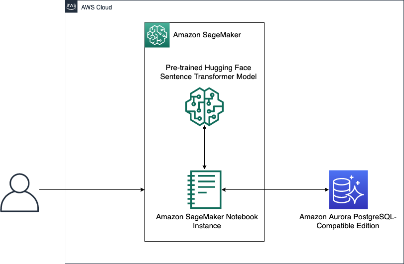

# Leverage pgvector and Amazon Aurora PostgreSQL for Natural Language Processing, Chatbots and Sentiment Analysis

## Introduction - pgvector and Aurora Machine Learning for Sentiment Analysis

[Amazon Comprehend](https://aws.amazon.com/comprehend/) is a natural language processing (NLP) service that uses machine learning to find insights and relationships in text. No prior machine learning experience is required. This example will walk you through the process of integrating Amazon Aurora PostgreSQL-Compatible Edition with the Comprehend Sentiment Analysis API and making sentiment analysis inferences via SQL commands. For our example, we have used a sample dataset with data for Fictitious Hotel Reviews.

Note: This demo involves creating an IAM Role and an associated IAM Policy to allow Amazon Aurora to interface with Amazon Comprehend. For steps on how to do this, please read through the blog post: [Leverage pgvector and Amazon Aurora PostgreSQL for Natural Language Processing, Chatbots and Sentiment Analysis](https://aws.amazon.com/blogs/database/leverage-pgvector-and-amazon-aurora-postgresql-for-natural-language-processing-chatbots-and-sentiment-analysis/).

## Architecture



## Dependencies and Installation

Please follow these steps:

1. Clone the repository to your local machine.

2. Create a new [virtual environment](https://docs.python.org/3/library/venv.html#module-venv) and launch it.

```
python3.9 -m venv env
source env/bin/activate
```

3. Create a `.env` file in your project directory similar to `env.example` to add your HuggingFace access tokens and Aurora PostgreSQL DB details. If you don't have one, create a new access token - [HuggingFace](https://huggingface.co/settings/tokens). Your .env file should like the following:

```
HUGGINGFACEHUB_API_TOKEN=<<access_token>>

PGVECTOR_DRIVER='psycopg2'
PGVECTOR_USER='<username>'
PGVECTOR_PASSWORD='<password>'
PGVECTOR_HOST='<Aurora DB Cluster host>'
PGVECTOR_PORT=5432
PGVECTOR_DATABASE='<dbname>'
```

4. Install the required dependencies by running the following command:

```
pip install -r requirements.txt
```

5. Make sure you have Jupyter notebook installed. For this demo, I have used the [Jupyter notebook](https://marketplace.visualstudio.com/items?itemName=ms-toolsai.jupyter) extension in VS code (highly recommended for local testing). 

## Usage

Please follow these steps:

1. Ensure that you have installed the required dependencies and added the HuggingFace API key to the `.env` file.

2. Ensure that you have added the Aurora PostgreSQL DB credentials to the `.env` file.

3. Ensure you have installed the extension `pgvector` and `aws_ml` on your Aurora PostgreSQL DB cluster:

```
CREATE EXTENSION IF NOT EXISTS aws_ml CASCADE;
CREATE EXTENSION IF NOT EXISTS vector;
```

5. Step through and run each cell in the `pgvector_with_langchain_auroraml.ipynb` notebook.

## I am encountering an error about token dimension mismatch (1536 vs 768)

Follow the recommendations from this [GitHub Issue thread](https://github.com/hwchase17/langchain/issues/2219).

## Contributing

This repository is intended for educational purposes and does not accept further contributions. Feel free to utilize and enhance the app based on your own requirements.

## License

The pgvector and Aurora Machine Learning for Sentiment Analysis demo is released under the [MIT-0 License](https://spdx.org/licenses/MIT-0.html).
