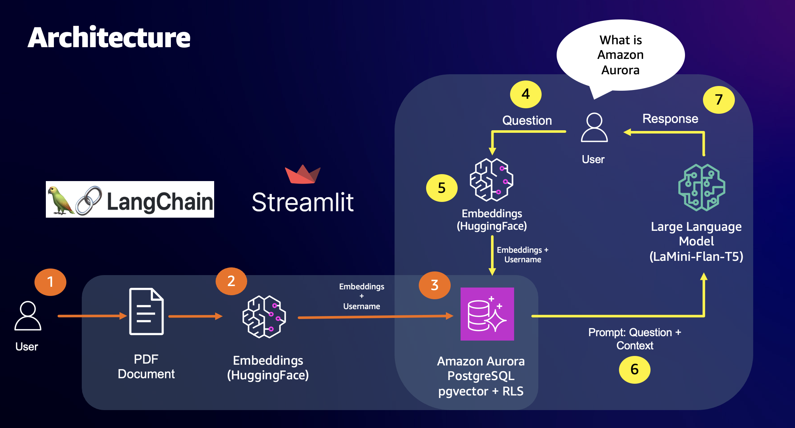

## RAG-based Q&A with PostgreSQL Row-Level Security"

Organizations have requirements to search vast corpus of internal data, but to provide fine grained access control  based on the user who is querying it. It may be required to build a system where based on the user authenticated will have access to certain sets of data to search for to provide any answers to the question asked. 

With RAG, we pass a user's question and a prompt in the form of numerical representation (vector embeddings) to a vector database. In this lab, we use a combination of different AWS services including [Amazon Bedrock](https://aws.amazon.com/bedrock/), an easy way to build and scale generative AI applications with foundation models. We use [Titan Embeddings G1 - Text](https://aws.amazon.com/bedrock/titan/) for text embeddings, [Anthropic's Claude v2]((https://aws.amazon.com/bedrock/claude/)) on Amazon Bedrock as our LLM and the [pgvector](https://github.com/pgvector/pgvector) extension on Amazon Aurora PostgreSQL-Compatible Edition as our vector database. We retrieve the most up-to-date or context-specific data from our vector database based on the user logged in and make it available to an LLM when asking it to generate a response. We also demonstrate integration with open-source frameworks such as LangChain for interfacing with all the components and Streamlit for building the chatbot frontend.

### Q&A with RAG (Retrieval-Augmented Generation):

**Retrieval-Augmented Generation (RAG)** is an advanced natural language processing (NLP) model that combines the strengths of both retrieval-based and generative approaches. In a typical Q&A system, RAG first retrieves relevant information from a knowledge base or database and then generates a human-like response. This two-step process aims to provide accurate and contextually appropriate answers to user queries.
Row-Level Security (RLS) in Postgres:

**Row-Level Security (RLS)** is a feature in relational database management systems, such as PostgreSQL (Postgres), that allows administrators to control access to rows in database tables based on the characteristics of the user executing a query. It enables fine-grained control over data access by defining policies that determine which rows a user can view or modify. RLS is particularly valuable in scenarios where different users or roles have varying levels of authorization to access specific data.

When combined, Q&A with RAG and Row-Level Security provides a powerful and secure solution for handling user queries and ensuring data privacy. The Q&A system powered by RAG enhances natural language understanding and response generation, while Row-Level Security ensures that users can only access the data for which they have the appropriate permissions. This integration is especially useful in applications where sensitive information needs to be protected, and access control is crucial, such as in healthcare, finance, legal, or any other domain with stringent data security requirements.

In this workshop , we will build an application where user's can upload their own documents which will be embedded and stored in the Aurora PostgreSQL vector store and using Row-Level security (RLS) feature in Aurora to provide fine grained access control on those vector embeddings.

## Use cases

The Retrieval Augmented Generation pattern is good for the following use cases:

- **Customizable Knowledge Portals**: Learn to build knowledge portals that not only provide insightful answers but also adhere to specific user roles and permissions through Row-Level Security. Tailor information access based on individual needs and organizational hierarchies.
- **Security-Driven Q&A**: Dive into the implementation of row-level security using Postgres, safeguarding sensitive data while delivering seamless and secure Q&A interactions.
- **Personalized User Experiences**: iscover how RAG's customizable search empowers the creation of personalized user experiences, tailoring responses to individual preferences and requirements.

## How it works

The application follows these steps to provide responses to your questions:

1. **PDF Loading**: The app reads PDF documents and extracts their text content.

2. **Text Chunking**: The extracted text is divided into smaller chunks that can be processed effectively.

3. **Embedding**: The application utilizes Titan Text from Amazon Bedrock to generate vector representations (embeddings) of the text chunks and uploads it to user table along with the user who uploaded it.

4. **User Question**: The user asks a question in natural language and choose the user whom uploaded the documents.

5. **Similarity Matching**: When the user asks a question, the app compares it with the text chunks with Row level security and identifies the most semantically similar ones based on the user requested it.

6. **RAG**: The user question and the context from the vector database is passed to the LLM (Anthropic's Claude on Amazon Bedrock).

7. **Response Generation**: The LLM generates a response based on the relevant content of the PDFs.

The following architecture diagram illustrates how it works:

