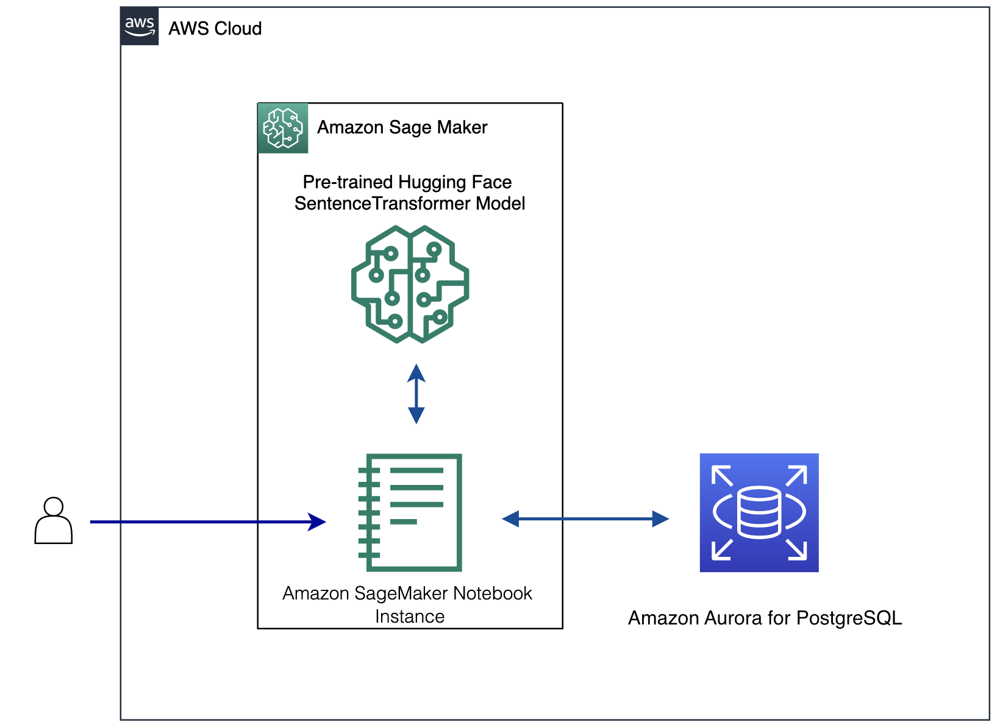

# Building AI-powered search in PostgreSQL using Amazon SageMaker and pgvector

This repository guides users through creating a product similarity search using Amazon SageMaker and Amazon Aurora for PostgreSQL using the extension `pgvector`.

# How does it work?

we have used pre-trained model [`all-MiniLM-L6-v2`](https://huggingface.co/sentence-transformers/all-MiniLM-L6-v2) from Hugging Face SentenceTransformers to generate fixed 384 length sentence embedding from feidegger, a zalandoresearch dataset. Then those feature vectors are stored in [Amazon Aurora for PostgreSQL](https://docs.aws.amazon.com/AmazonRDS/latest/AuroraUserGuide/Aurora.AuroraPostgreSQL.html) using extension `pgvector` for product similarity search.

# What is `pgvector`?

pgvector is an open-source extension designed to augment PostgreSQL databases with the capability to store and conduct searches on ML-generated embeddings to identify both exact and approximate nearest neighbors. It’s designed to work seamlessly with other PostgreSQL features, including indexing and querying. 

To generate vector embeddings, you can use ML service such as [Amazon SageMaker](https://aws.amazon.com/sagemaker/) or [Amazon Bedrock](https://aws.amazon.com/bedrock/) (limited preview). SageMaker allows you to easily train and deploy machine learning models, including models that generate vector embeddings for text data.

By utilizing the pgvector extension, PostgreSQL can effectively perform similarity searches on extensive vector embeddings, providing businesses with a speedy and proficient solution. 

Please review pgvector [documentation](https://github.com/pgvector/pgvector) for additional details.

# Solution

## Security

See [CONTRIBUTING](CONTRIBUTING.md#security-issue-notifications) for more information.

## License

This library is licensed under the MIT-0 License. See the LICENSE file.
