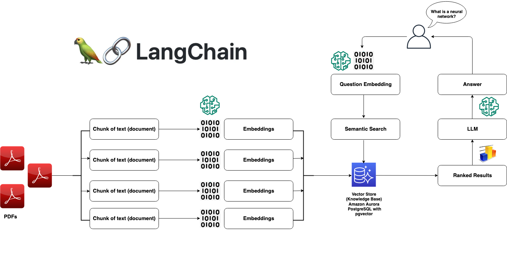

# Leverage pgvector and Amazon Aurora PostgreSQL for Natural Language Processing, Chatbots and Sentiment Analysis

## Introduction - Build and deploy an AI-powered chatbot application

The GenAI Q&A Chatbot with pgvector and Amazon Aurora PostgreSQL-compatible edition application is a Python application that allows you to interact with multiple PDF documents. You can ask questions about the PDFs using natural language, and the application will provide relevant responses based on the content of the documents. This app utilizes a language model to generate accurate answers to your queries. Please note that the app will only respond to questions related to the loaded PDFs.

## Conceptual Flow Diagram



## How It Works

The application follows these steps to provide responses to your questions:

1. PDF Loading: The app reads multiple PDF documents and extracts their text content.

2. Text Chunking: The extracted text is divided into smaller chunks that can be processed effectively.

3. Language Model: The application utilizes a language model to generate vector representations (embeddings) of the text chunks.

4. Similarity Matching: When you ask a question, the app compares it with the text chunks and identifies the most semantically similar ones.

5. Response Generation: The selected chunks are passed to the language model, which generates a response based on the relevant content of the PDFs.

## Dependencies and Installation

To build the GenAI Q&A chatbot with pgvector and Amazon Aurora PostgreSQL, please follow these steps:

1. Clone the repository to your local machine.

2. Create a new [virtual environment](https://docs.python.org/3/library/venv.html#module-venv) and activate it.
```
python3.9 -m venv env
source env/bin/activate
```

3. Create a `.env` file in your project directory similar to `env.example` to add your HuggingFace access tokens and Aurora PostgreSQL DB cluster details. If you don't have one, create a new access token on HuggingFace's website - [HuggingFace](https://huggingface.co/settings/tokens). Your .env file should like the following:
```
HUGGINGFACEHUB_API_TOKEN=<<access_token>>

PGVECTOR_DRIVER='psycopg2'
PGVECTOR_USER='<<Username>>'
PGVECTOR_PASSWORD='<<Password>>'
PGVECTOR_HOST='<<Aurora DB cluster host>>'
PGVECTOR_PORT=5432
PGVECTOR_DATABASE='<<DBName>>'
```

4. Install the required dependencies by running the following command:
```
pip install -r requirements.txt
```

## Usage

To use the GenAI Q&A with pgvector and Amazon Aurora PostgreSQL App, follow these steps:

1. Ensure that you have installed the required dependencies and added the HuggingFace API access tokens and Aurora PostgreSQL DB details to the `.env` file.

2. Ensure you have installed the extension `pgvector` on your Aurora PostgreSQL DB cluster:
   ```
   CREATE EXTENSION vector;
   ```

3. Run the `app.py` file using the Streamlit CLI. Execute the following command:
   ```
   streamlit run app.py
   ```

4. The application will launch in your default web browser, displaying the user interface.

5. Load multiple PDF documents into the app by following the provided instructions.

6. Ask questions in natural language about the loaded PDFs using the search interface.

## I am encountering an error about token dimension mismatch (1536 vs 768)

Follow the recommendations from this [GitHub Issue thread](https://github.com/hwchase17/langchain/issues/2219).

## Contributing

This repository is intended for educational purposes and does not accept further contributions. Feel free to utilize and enhance the app based on your own requirements.

## License

The GenAI Q&A Chatbot with pgvector and Amazon Aurora PostgreSQL-compatible edition application is released under the [MIT-0 License](https://spdx.org/licenses/MIT-0.html).
